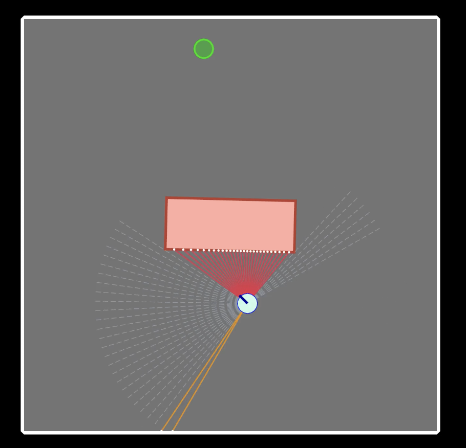
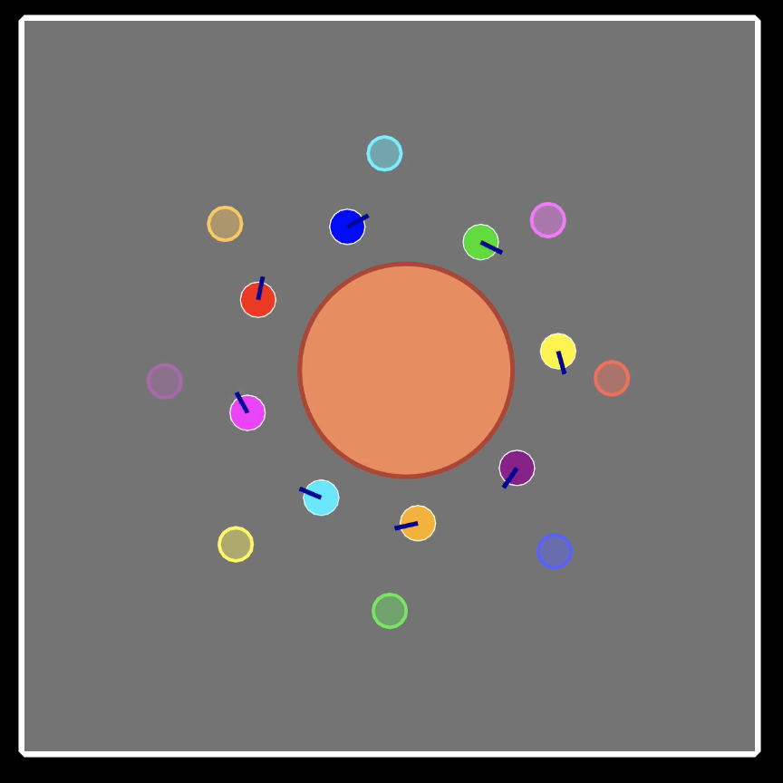
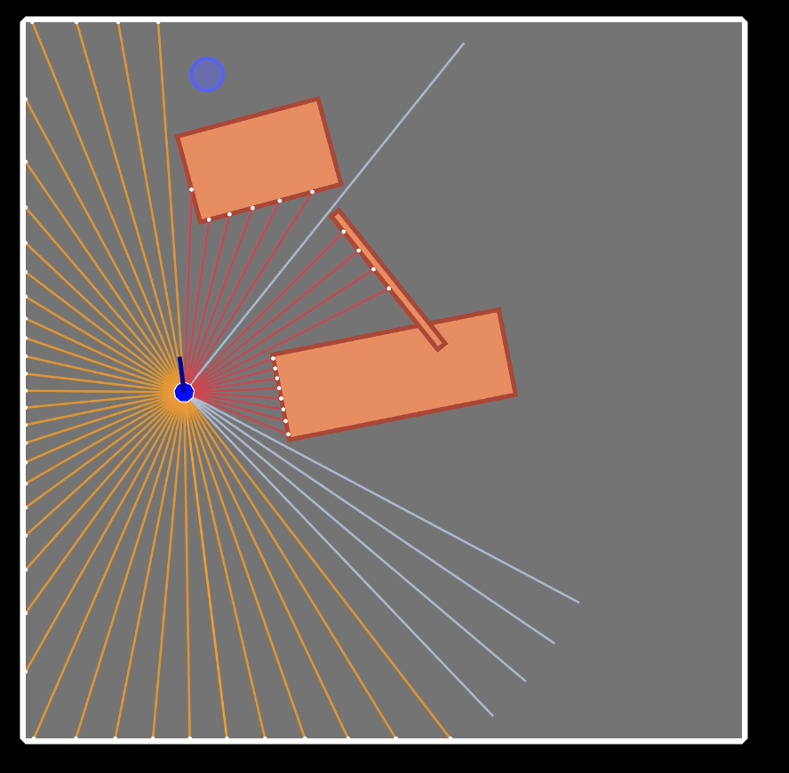
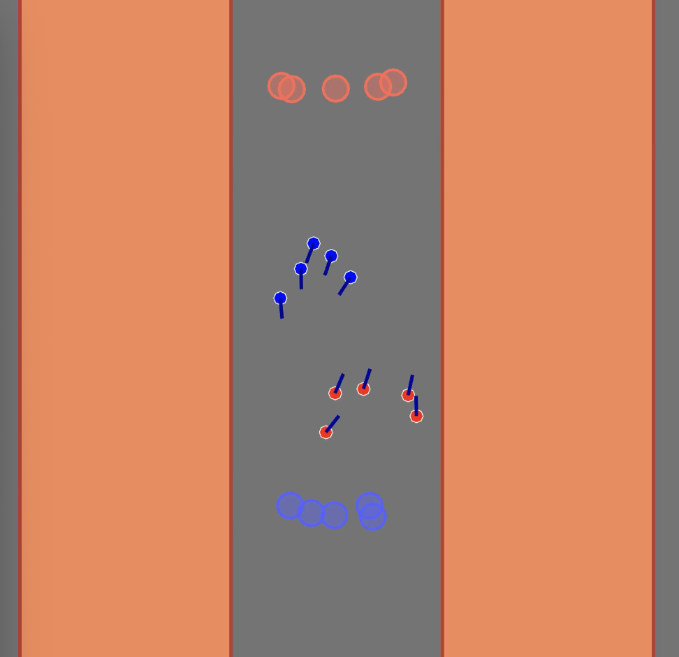
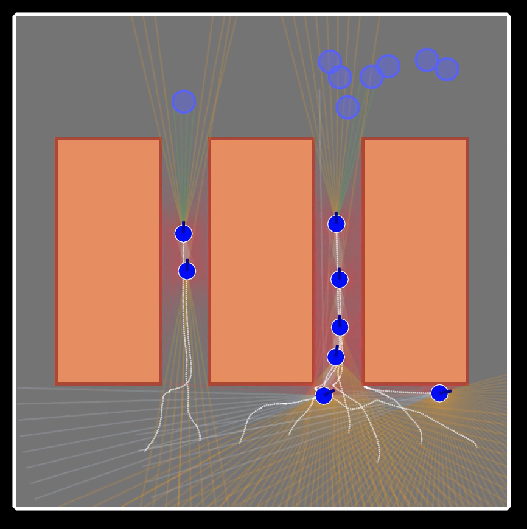
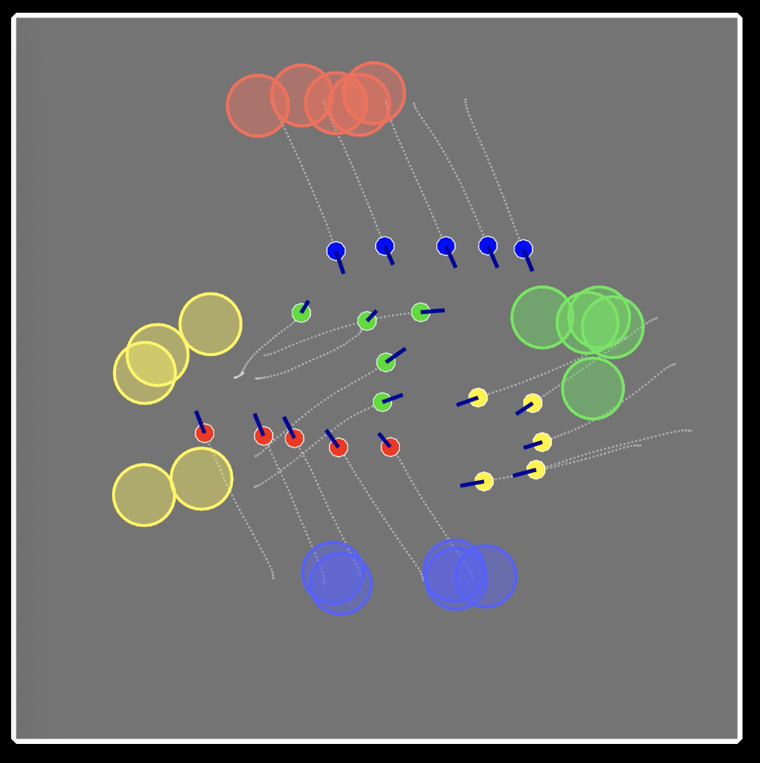

# Multi Agent Navigation


## Project Description
The core RL task involves multiple agents (represented as colored circles and arrow-heads) navigating from their starting positions to their respective end goals while avoiding collisions with other agents and static obstacles. 

To do this, we are using a CTDE (Centralized Training Decentralized Execution) approach to train agents. Specifically, we are using MAPPO (Multi-Agent Proximal Policy Optimization), a variant of PPO inspired by MADDPG.


## Getting Started

### Prerequisites

-   **Python 3.10+** (required)
-   **`uv`** (recommended) or `pip` for package management
-   To render movies and videos, install ffmpeg

### Installation

1.  **Clone the repository**

2.  **Install dependencies:**
    ```bash
    # Using uv
    uv sync
    ```

3.  **Train a new model:**
    ```bash
    uv run train_mappo.py model_id configs/config.yaml
    ```

    For example:
    ```bash
    uv run train_mappo.py model_1 configs/basic_env.yaml
    ```

    This will create a new model inside `models/model_1`. The latest model and the best all-time models are both saved.

4. **Run inference**
    ```bash
    uv run inference.py models/model_1
    ```

    By default, this will test on the environment config file where the model was originally trained. You can also test on a new config though.

    ```bash
    uv run inference.py models/model_1 configs/bottleneck.yaml
    ```


## Included Environments

A variety of pre-configured environments are provided for your experiments in the `configs/` directory.

1. Basic

   

2. Circle

   

3. Moving Environment

   

4. Hallway

   

5. Bottleneck

   

6. Four Crossing

   


## Creating Custom Environments

You can define your own environments by creating a new `.yaml` file in the `configs/` directory. The configuration schema is defined in `nav/config_models.py`.

Key components of a configuration file:
- **Boundary**: Defines the polygon vertices for the playable area.
- **Agents**: Specifies start/goal zones (rectangles), physical properties (radius, max speed), and sensor settings (FOV, range).
- **Obstacles**: Defines static or moving obstacles (rectangles or circles).

For reference, check `configs/basic_env.yaml` for a simple setup or `configs/moving_env.yaml` for dynamic obstacles.

## MAPPO Configuration

The training configuration and hyperparameters are defined in `train_mappo.py`.

Key settings include:
- **History Length**: `history_length = 4` (Number of past frames stacked).
- **Batch Size**: `batch_size=128` (Number of samples per update).
- **Learning Rate**: `learning_rate=5e-4`.
- **Inference Interval**: `inference_interval=5` (How often to run evaluation episodes).
- **Network Architecture**: The policy network uses an `ObservationEncoder` which processes LIDAR data and agent states, outputting a feature vector of size 384.

To modify these, edit the `MAPPO` initialization in `train_mappo.py`.

## Rendering

Check out `nav/live_renderer.py` to see useful rendering settings.

## Environment Details

The environment specifications are defined in `nav/environment.py`.

### Observation Space (`Box`)
Each agent receives a composite observation consisting of:
1.  **State Vector**:
    -   Progress towards goal (normalized 0-1).
    -   Cosine of the angle between the agent's heading and the goal.
    -   Current speed ratio (current_speed / max_speed).
    -   Distance to goal.
    -   Goal vector (x, y).
2.  **LIDAR Readings**:
    -   A set of raycasts (default 60 rays).
    -   Each ray returns 3 channels: [Distance to Obstacle, Distance to Boundary, Distance to Agent].
    -   Stacked with `history_length` (default 4) frames to provide temporal context.

### Action Space (`Box(2,)`)
The agent controls its movement via a continuous 2D vector:
-   `[vx, vy]`: Velocity components in the X and Y directions.
-   Values are clipped to the range `[-1, 1]` and scaled by the agent's `max_speed`.
-   The action is applied in the Local Coordinate Space of the agent, where the origin is at the agent's center, and the Y-axis is the agent's goal vector.

### Reward Structure
The reward function incentivizes reaching the goal while avoiding collisions:
-   **Goal Reached**: `+10`
-   **Collision** (Obstacle, Boundary, or Agent): `-10`
-   **Progress Reward**: Scaled by speed and alignment with the goal direction (encourages moving efficiently towards the target).
-   **Time Penalty (Stay Alive)**: `-0.05` per step (encourages reaching the goal quickly).

## Network Architecture

The model architecture (found in `rl/mappo.py` and `networks/actor_critic_network.py`) implements the Actor-Critic method with shared features.
