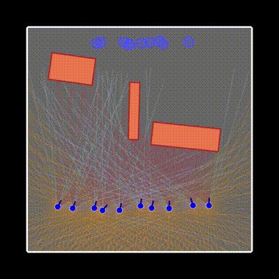

# Multi Agent Navigation



## Project Description
The core RL task involves multiple agents (represented as colored circles and arrow-heads) navigating from their starting positions to their respective end goals while avoiding collisions with other agents and static obstacles. 

To do this, we are using a CTDE (Centralized Training Decentralized Execution) approach to train agents. Specifically, we are using MAPPO (Multi-Agent Proximal Policy Optimization), a variant of PPO inspired by MADDPG.


## Getting Started

### Prerequisites

-   **Python 3.10+** (required)
-   **`uv`** (recommended) or `pip` for package management
-   To render movies and videos, install ffmpeg

### Installation

1.  **Clone the repository**

2.  **Install dependencies:**
    ```bash
    # Using uv
    uv sync
    ```
    
3.  **Train a new model:**
    ```bash
    uv run train_mappo.py model_id configs/config.yaml
    ```

    For example:
    ```bash
    uv run train_mappo.py model_1 configs/basic_env.yaml
    ```

    This will create a new model inside `models/model_1`. The latest model and the best all-time models are both saved.

4. **Run inference**
    ```bash
    uv run inference.py models/model_1
    ```

    By default, this will test on the environment config file where the model was originally trained. You can also test on a new config though.

    ```bash
    uv run inference.py models/model_1 configs/bottleneck.yaml
    ```